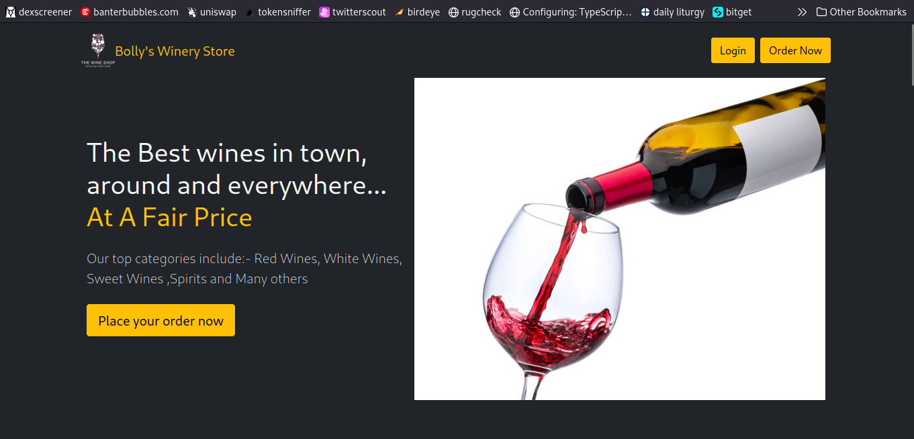
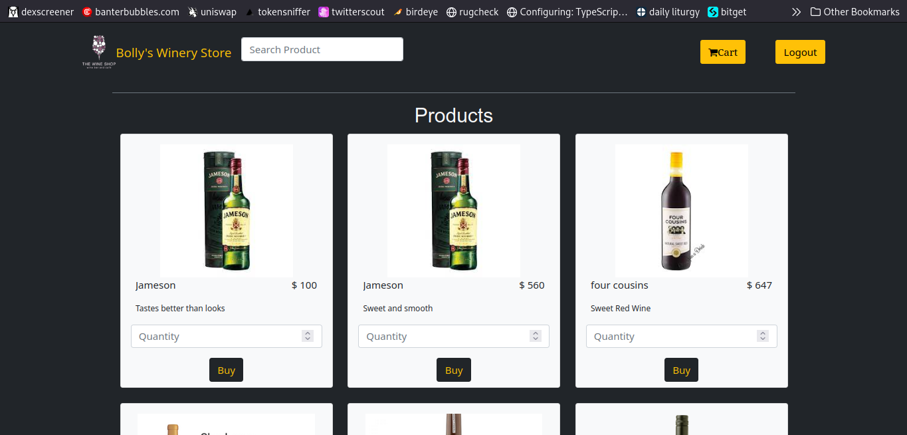
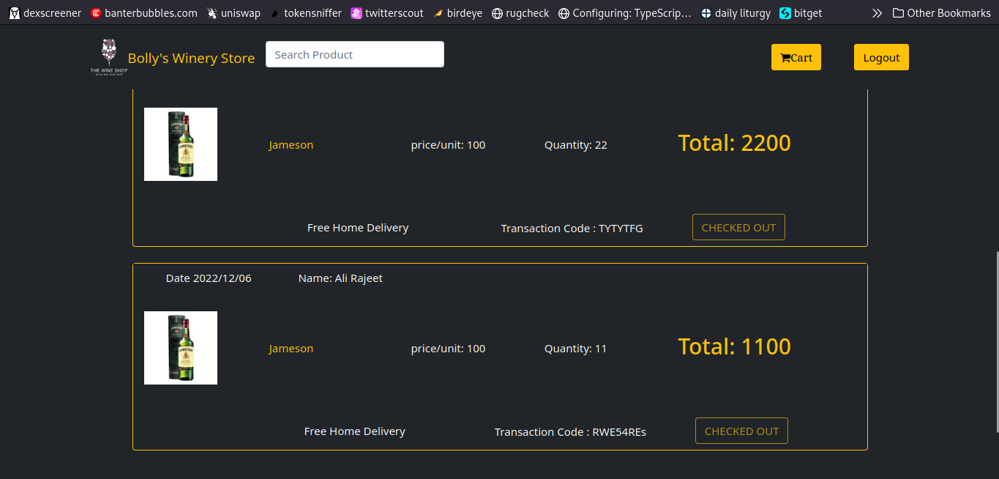

# Bolly's Winery Store: A PHP, MySQL, JQuery online winery store.

## Languages Used:
1. PHP
2. JavaScript

The project is built on `HTML5` and `Bootstrap 5`.

## Getting Started

To get started with this project:

1. **Clone the Repository**
```bash
    git clone https://github.com/patrickkariukikabita/winery.git
```
    or download the code from this repository.

2. **Upload the Project to the Server Root**

    Upload all project files to the root directory of your web server. Example on linux:
```bash
    mv winery /opt/lampp/htdocs/
```
on windows
move `winery` to ` C:\xampp\htdocs\`

3. **Navigate to the Project Directory**
```bash
    cd winery
```

4. **Create a Database**

    Create a MySQL database named `winery` and upload the `winery.sql` file to populate the database. You can use tools like phpMyAdmin or the MySQL command line for this.

5. **Configure Database Connection**

    Open the `config.php` file in the `resources` directory and update the database connection settings with your database credentials.
```php
    $serverhost = "localhost";
    $dbusername = "[your database username]";
    $dbpassword = "[your database password]";
    $dbasename = "winery";
    $siteName="Bolly's Winery Store"; // Change this to modify the site name
```

6. **Dependencies**

    This project uses the following dependencies:
    - jQuery 3.6.3
    - FontAwesome 4.7.0 icons


8. **Start the Development Server**

    If you're using a local server environment like XAMPP, WAMP, or MAMP, start the server and ensure that Apache and MySQL are running. If you're on a live server, ensure the server is configured to handle PHP and MySQL.

9. **View the Application**

    Open your web browser and navigate to `http://localhost/winery` (for a local server) or your domain name (for a live server) to view and interact with the blog application.

    You can try the project out using the credentials:
```javascript
    username: abc@gmail.com
    password: 1111
```

## Project Overview

### Screenshots

#### Homepage



#### Products


#### User Cart



## Visit My Site

- [www.bytemast.com](https://bytemast.com)

Feel free to explore the project, provide feedback or suggestions, and consider giving this project a star if you like it.
