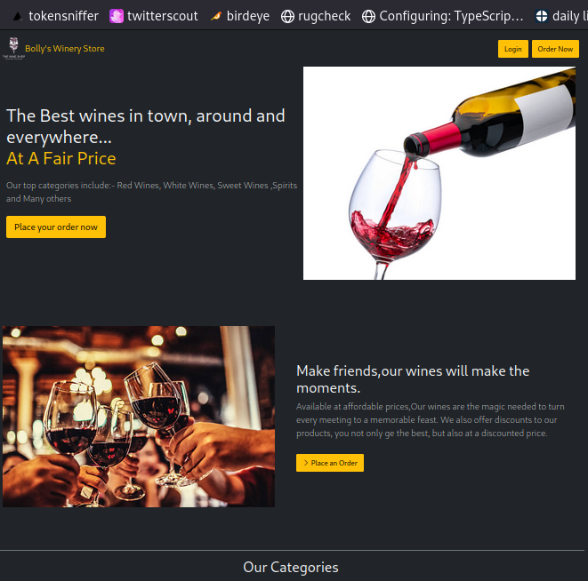

# Bolly's Winery Store: A PHP, MySQL, JQuery online winery store

## Table of Contents
- [Languages Used](#languages-used)
- [Getting Started](#getting-started)
  - [Clone the Repository](#clone-the-repository)
  - [Upload the Project to the Server Root](#upload-the-project-to-the-server-root)
  - [Navigate to the Project Directory](#navigate-to-the-project-directory)
  - [Create a Database](#create-a-database)
  - [Configure Database Connection](#configure-database-connection)
  - [Dependencies](#dependencies)
  - [Start the Development Server](#start-the-development-server)
  - [View the Application](#view-the-application)
- [Project Overview](#project-overview)
  - [Screenshots](#screenshots)
    - [Homepage](#homepage)
    - [Products](#products)
    - [User Cart](#user-cart)
- [Visit My Site](#visit-my-site)

## Languages Used
1. PHP
2. JavaScript

The project is built on `HTML5` and `Bootstrap 5`.

## Getting Started

### Clone the Repository
```bash
git clone https://github.com/patrickkariukikabita/winery.git
```
or download the code from this repository.

### Upload the Project to the Server Root
Upload all project files to the root directory of your web server. Example on Linux:
```bash
mv winery /opt/lampp/htdocs/
```
On Windows, move `winery` to `C:\xampp\htdocs\`.

### Navigate to the Project Directory
```bash
cd winery
```

### Create a Database
Create a MySQL database named `winery` and upload the `winery.sql` file to populate the database. You can use tools like phpMyAdmin or the MySQL command line for this.

### Configure Database Connection
Open the `config.php` file in the `resources` directory and update the database connection settings with your database credentials.
```php
$serverhost = "localhost";
$dbusername = "[your database username]";
$dbpassword = "[your database password]";
$dbasename = "winery";
$siteName = "Bolly's Winery Store"; // Change this to modify the site name
```

### Dependencies
This project uses the following dependencies:
- jQuery 3.6.3
- FontAwesome 4.7.0 icons

### Start the Development Server
If you're using a local server environment like XAMPP, WAMP, or MAMP, start the server and ensure that Apache and MySQL are running. If you're on a live server, ensure the server is configured to handle PHP and MySQL.

### View the Application
Open your web browser and navigate to `http://localhost/winery` (for a local server) or your domain name (for a live server) to view and interact with the application.

You can try the project out using the credentials:
```javascript
username: abc@gmail.com
password: 1111
```

## Project Overview

### Screenshots

#### Homepage



#### Products


#### User Cart


## Visit My Site
- [www.bytemast.com](https://bytemast.com)

Feel free to explore the project, provide feedback or suggestions, and consider giving this project a star if you like it.
